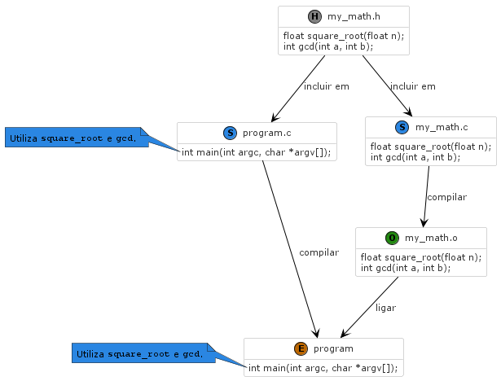
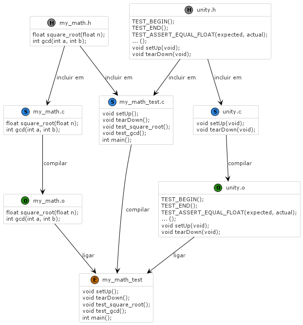

# Programação e Algoritmos - [IADE UE](https://www.iade.europeia.pt/)

## Exemplo de construção de testes unitários

# Projeto exemplo

## Biblioteca de funções matemáticas

Pretende-se construir uma biblioteca de funções matemáticas. Neste exemplo, serão construídas as funções raiz quadrada, e maior divisor comum.

Tradicionalmente, as funções são escritas em ficheiros separados, e compiladas para gerar um ficheiro de objeto. Este ficheiro é então ligado a um ficheiro de um programa (i.e., com função `main`), que descreve um cenário de utilização.



## Problema

A construção de um programa de teste segundo a abordagem descrita requer a implementação de um protocolo que assegure a coerência entre testes, quer na descrição de cenários, como no output, tanto no caso de sucesso como no caso de insucesso.

Idealmente, a falha num teste deve indicar que condição esperada não foi verificada, e em que cenário de teste.

É também importante que a abordagem permita executar sempre todos os testes escritos até ao momento. É a única forma de garantir que o programa está a funcionar corretamente, e que alterações recentes não introduziram erros em funções já testadas anteriormente.

O valor da coleção de testes depende bastante da capacidade de sistematização e automatização da abordagem.

## Testes unitários

A utilização de testes unitários oferece essa sistematização. Os testes unitários são executados de forma automática, e permitem verificar se o comportamento das funções está de acordo com o esperado.

Para suportar a escrita de cenários de teste (i.e., funções que descrevem a invocação de funções e a verificação do seu comportamento), é necessário utilizar uma biblioteca de testes. Neste exemplo, será utilizada a biblioteca [Unity Test](https://github.com/ThrowTheSwitch/Unity).

A Unity Test determina que cada programa de teste deve ser um ficheiro separado, e que deve conter uma função `main`. A função `main` deve invocar as macros `UNITY_BEGIN`, `RUN_TEST`, e `UNITY_END`. A macro `RUN_TEST` é utilizada para invocar cada cenário de teste.



## Compilar e executar

Para compilar o programa de teste, é necessário utilizar o compilador C, e o compilador C++ para compilar a biblioteca de testes. Para executar o programa de teste, é necessário executar o ficheiro gerado.

```bash
gcc -c my_math.c -o my_math.o
gcc -c unity.c -o unity.o
gcc my_math_test.c my_math.o unity.o -o my_math_test
./my_math_test
```

Ou output esperado é o seguinte:

```bash
my_math_test.c:21:test_square_root:PASS
my_math_test.c:22:test_gcd:PASS

-----------------------
2 Tests 0 Failures 0 Ignored
OK
```
